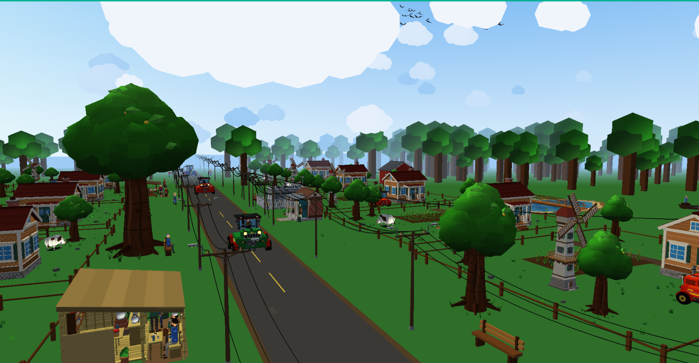

# Animated 3D Farm Scene

A real-time interactive rural environment built with C++17, GLFW, and the OpenGL 2.1 compatibility pipeline. The project presents a populated farm village with reusable procedural models, first-person exploration, dynamic day/night lighting, traffic, workers, animals, weather effects, interactive barns, ponds, bonfires, and electrical load shedding.

**Author:** Niloy Chowdhury

**Roll:** 2107117

**License:** MIT



## Table of contents

- [Project overview](#project-overview)
- [Feature highlights](#feature-highlights)
- [Technology and requirements](#technology-and-requirements)
- [Build and run](#build-and-run)
- [Controls](#controls)
- [Architecture](#architecture)
- [Scene systems](#scene-systems)
- [Rendering and performance](#rendering-and-performance)
- [Configuration](#configuration)
- [Testing and benchmarking](#testing-and-benchmarking)
- [Project structure](#project-structure)
- [Known limitations](#known-limitations)
- [Troubleshooting](#troubleshooting)
- [Documentation](#documentation)

## Project overview

The application creates a large stylized farm and village entirely from reusable OpenGL primitives. It does not depend on downloaded 3D models or a texture pack. Houses, barns, tractors, people, animals, crops, trees, shops, utility infrastructure, ponds, bridges, and environmental effects are assembled hierarchically from cubes, planes, cylinders, and spheres.

The current scene contains:

- 12 varied farm plots arranged on both sides of a central rural road.
- Three moving road tractors with seated drivers, wheel animation, and night headlights.
- A separate manually controlled tractor.
- Farmhouses, crop rows, fences, gates, paths, windmills, barns, and tea shops.
- Animated cows, chickens, crop workers, road pedestrians, villagers, and birds.
- Three animated ponds, including an active wooden bridge implemented in `Pond.cpp`.
- A power substation, roadside poles, suspended conductors, lamps, and load shedding.
- Five bonfire gathering sites with villagers, logs, stones, flames, embers, smoke, and sparks.
- A smoothly interpolated day/night system with sun, moon, stars, clouds, fog, moonlight, warm local lights, and power-dependent illumination.

The visual style deliberately favors readable low-polygon silhouettes and hierarchical transformations. This keeps the implementation suitable for learning classic computer-graphics concepts while still supporting a substantial interactive scene.

## Feature highlights

### Exploration and window handling

- Heading-relative first-person movement with delta-time integration.
- `W` and `S` follow the camera's current horizontal heading.
- `A` and `D` turn the camera in place instead of orbiting or strafing.
- Mouse look and keyboard look update the same yaw/pitch orientation.
- Smooth combined movement and turning, including `W+A`, `W+D`, `S+A`, and `S+D`.
- Opposing inputs cancel predictably, and held inputs are cleared when focus is lost.
- Separate vertical movement, sprint, and precision-speed controls.
- Resizable window with framebuffer-aware viewport and projection updates.
- Fullscreen transitions preserve the previous windowed position and dimensions.
- Runtime VSync control and live FPS/frame-time reporting in the title bar.

### Environment and village life

- Deterministic placement for the road, farms, landmarks, utility corridor, ponds, forest belts, and bonfire clearings.
- Reusable farm layouts with varied houses, crops, trees, animals, tractors, chickens, and windmills.
- Three distinct roadside tea-shop designs: timber, brick, and bamboo.
- Roads include shoulders, dashed center markings, entrance gaps, and subtle weathering patches.
- Grass, flowers, flowering shrubs, and flowering trees respect exclusion zones around roads, buildings, paths, ponds, and fires.
- Benches, stools, split-log seats, bicycles, counters, shelves, cups, kettles, signs, and other village props add environmental detail.

### Animation and interaction

- Frame-rate-independent vehicle, pedestrian, worker, cloud, bird, water, windmill, fire, and animal animation.
- Traffic can be paused independently without destroying convoy spacing.
- Field-worker animation can be paused or speed-adjusted independently.
- The global animation clock can be paused while day/night transitions continue.
- Barn doors, feeding gates, storage chests, and wheelbarrows are interactive.
- Closed barn doors participate in camera collision; open doors allow entry.
- Cows graze, chew, blink, flick their ears and tails, and occasionally raise their heads.
- Chickens walk and peck; villagers use varied idle and conversation gestures.

### Lighting and atmosphere

- Three-second day/night crossfade controlled from centralized settings.
- Directional daylight transitions into cool moonlight.
- Warm farmhouse, shop, barn, street, substation, bonfire, and vehicle lighting.
- The seven available secondary fixed-function lights are ranked by camera distance and importance before use.
- Independent power-outage behavior: electric fixtures fade, while moonlight, stars, bonfires, and headlights remain available.
- Windmills coast to a stop during load shedding and accelerate smoothly when power returns.
- Linear fog and camera-centered sky rendering hide the world boundary and improve depth perception.

## Technology and requirements

### Core technology

| Component | Use |
|---|---|
| C++17 | Application, simulation, scene management, and procedural models |
| OpenGL 2.1 compatibility profile | Fixed-function transforms, lighting, fog, materials, blending, and immediate-mode geometry |
| GLFW 3 | Window creation, OpenGL context, keyboard/mouse input, timing, fullscreen, and VSync |
| CMake 3.16 or newer | Primary build system |
| CTest | Deterministic camera-control test registration and execution |

### Required development tools

- A C++17 compiler.
- CMake 3.16 or newer.
- OpenGL development libraries and a driver supporting the OpenGL 2.1 compatibility profile.
- GLFW 3 with a discoverable CMake package configuration.

The validated Windows configuration uses the MSYS2 UCRT64 toolchain:

- `C:\msys64\ucrt64\bin\g++.exe`
- `C:\msys64\ucrt64\bin\mingw32-make.exe`
- `C:\msys64\ucrt64\lib\cmake\glfw3`

The CMake build is intended to remain portable, but the supplied convenience scripts link Windows system libraries and therefore target Windows/MSYS2.

## Build and run

### Recommended: CMake with MSYS2 UCRT64 on Windows

From PowerShell in the repository root:

```powershell
cmake -S . -B build-cmake -G "MinGW Makefiles" `
  -DCMAKE_BUILD_TYPE=Release `
  -DCMAKE_PREFIX_PATH=C:/msys64/ucrt64 `
  -DCMAKE_CXX_COMPILER=C:/msys64/ucrt64/bin/g++.exe `
  -DCMAKE_MAKE_PROGRAM=C:/msys64/ucrt64/bin/mingw32-make.exe

cmake --build build-cmake -j 4

$env:PATH = "C:\msys64\ucrt64\bin;$env:PATH"
.\build-cmake\Animated3DFarmScene.exe
```

The initial window size is 1280 x 720. The window can be resized down to 640 x 360, and `F11` switches between windowed and fullscreen modes.

### Generic CMake workflow

If GLFW and OpenGL are already discoverable by CMake:

```bash
cmake -S . -B build -DCMAKE_BUILD_TYPE=Release
cmake --build build --config Release
```

Run the resulting `Animated3DFarmScene` executable from the selected build directory. On Windows, ensure the directory containing the GLFW runtime DLL is on `PATH`.

### Convenience scripts

The repository also includes direct compiler scripts:

```powershell
.\run_phase1.ps1
```

or from Git Bash/MSYS2:

```bash
./run_phase1.sh
```

Despite their historical `phase1` names, both scripts currently compile the complete source list and launch the current application. CMake is preferred for repeatable builds and test integration.

## Controls

### Camera and application

| Input | Action |
|---|---|
| `W` / `S` | Move forward/backward along the camera's horizontal heading |
| `A` / `D` | Turn left/right around the camera's current position |
| `Q` / `E` | Move vertically up/down |
| `Left Shift` | Sprint at 3x normal movement speed |
| `Left Ctrl` | Precision movement at 0.3x normal speed |
| Mouse movement | Look around while the cursor is captured |
| Left click / `Tab` | Capture or release the mouse cursor |
| Arrow Left/Right | Alternative keyboard yaw controls |
| Arrow Up/Down | Look up/down |
| `R` | Reset camera position and orientation |
| `F11` | Toggle fullscreen/windowed mode |
| `V` | Toggle VSync |
| `Esc` | Release captured mouse; press again to exit |

Normal camera movement is 20 world units per second, keyboard turning is 90 degrees per second, and pitch is clamped to prevent camera inversion. Movement remains on the ground plane even when looking up or down. `Q` and `E` provide explicit vertical movement.

### World simulation

| Input | Action |
|---|---|
| `N` | Toggle day/night target |
| `P` | Pause/resume the shared scene-animation clock |
| `T` | Pause/resume road traffic and roadside pedestrians |
| `B` | Show/hide all five bonfire gatherings |
| `L` | Toggle grid power/load shedding |
| `O` | Pause/resume crop workers independently |
| `[` / `]` | Decrease/increase crop-worker speed |
| `+` / `-` | Increase/decrease windmill speed |

Toggle controls use edge-triggered input, so holding a key does not repeatedly switch the state.

### Vehicles and barns

| Input | Action |
|---|---|
| `I` / `K` | Drive the manual tractor forward/reverse |
| `J` / `;` | Steer the manual tractor left/right while driving |
| `G` | Open/close all barn sliding doors |
| `Z` / `X` | Roll the barn wheelbarrow toward the entrance/rear while held |
| `C` | Open/close the barn storage chest |
| `F` | Open/close the barn feeding gate |

The current implementation shares barn interaction state across all four barn instances, so one barn-control key affects every matching barn mechanism.

## Architecture

The active runtime follows this ownership and frame flow:

```text
main
  -> Application
       |- GLFW window, context, timing, resize/fullscreen, VSync, benchmarks
       |- Input state and edge detection
       |- Camera movement, mouse look, projection, and view matrices
       `- Scene
            |- Animation clock and simulation state
            |- Lighting and local-light selection
            |- Terrain, road, farms, traffic, workers, barns, ponds, village
            `- Reusable object and primitive modules
```

Each frame performs the following operations:

1. Poll GLFW events and update held/pressed key state.
2. Process application toggles such as fullscreen and VSync.
3. Handle scene toggles and continuous object controls.
4. Update the camera using bounded delta time.
5. Resolve camera movement against barn walls and door openings.
6. Update simulation, transitions, and object animation.
7. Render the camera-centered sky without world translation.
8. Apply the normal camera view and render the world.
9. Swap buffers and update title-bar performance/state telemetry.

### Main components

| Component | Responsibility |
|---|---|
| `Application` | Window lifecycle, frame loop, framebuffer resizing, fullscreen, VSync, benchmarking, and smoke tests |
| `Input` | Current and previous keyboard state, edge-triggered presses, and focus-loss clearing |
| `Camera` | Heading-relative movement, yaw/pitch, mouse capture, view matrix, and perspective projection |
| `Scene` | Active world ownership, simulation state, collision, culling, rendering order, and interaction routing |
| `Animation` | Shared pausable animation time and windmill controls |
| `Lighting` | Fixed-function global and directional light configuration |
| `Primitives` | Shared cube, plane, cylinder, and sphere geometry |
| `objects/*` | Reusable farm, vehicle, character, animal, structure, sky, pond, and village models |

`farmworld.cpp`, standalone `Bridge.cpp`, `PowerPlant.cpp`, `Shadow.cpp`, and `TextureManager.cpp` remain compiled legacy/reference modules but are not instantiated by the active `Application -> Scene` rendering path. The bridge visible in the current scene is implemented inside `Pond.cpp` and uses a sampled sine arch for its railings.

## Scene systems

### Farms and vegetation

The 12 farms use reusable geometry under root transforms rather than duplicated model code. A deterministic `FarmLayout` controls tree and animal counts, optional tractors and windmills, structure offsets, rotation, and startup chicken population. Crops, fences, paths, rocks, flowers, and grass are placed using local farm coordinates.

The wider world uses deterministic vegetation generation with explicit clearance tests for roads, buildings, ponds, and bonfires. Large tree populations are partitioned into spatial chunks for culling and level-of-detail selection.

### Traffic and characters

Three road tractors move along a wrapped route from `z = -108` to `z = 108` at 5.5 world units per second. Initial placement and a 50-unit minimum spacing keep the convoy separated. Wheels rotate from traveled distance, and each tractor carries a seated driver built from the shared villager model.

Four potential roadside pedestrians use active/wait intervals and spacing guards. Crop-worker populations are distributed across the farms with a maximum of three workers per farm. Their movement and working animations use delta time and independent speed controls.

### Animals

Cows use a detailed reusable low-polygon model with deterministic coat variants, articulated necks, horns, ears, muzzle, legs, hooves, udder, and tail. Position-derived animation phases prevent synchronized grazing. Chickens use lightweight walking, pecking, and wing/head motion suitable for repeated farm instances.

### Barns

Four barns contain an accessible shell and detailed interiors: stalls, troughs, hay bales, shelves, tools, a workbench, sacks, tack, ladder, loft, bucket, stool, milk can, wheelbarrow, storage chest, feeding gate, and lighting fixtures. Sliding doors are coupled to the barn collision test, while mechanical props remain usable during a power outage.

### Ponds and bridge

The scene includes one 36 x 26 main pond and two 32 x 23 secondary ponds. Water uses translucent layered geometry with time-varying color, circular ripples, shoreline banks, stones, reeds, lilies, and ducks. The active wooden bridge is part of `Pond.cpp`; its rail height follows a sine arch sampled into connected segments.

### Day/night and electrical power

`N` changes the target time of day, while the scene interpolates toward it over three seconds. Sky, fog, directional light, global ambient light, clouds, sun/moon visibility, stars, materials, terrain, and local lighting respond to the same normalized night amount.

Grid power is an independent state. During load shedding:

- Farmhouse, shop, barn, street, and substation electric lights fade out.
- Windmills coast to a stop.
- Moonlight, stars, bonfires, and vehicle headlights remain active.
- Manual barn mechanisms and other non-electrical interactions remain usable.

## Rendering and performance

The renderer targets the OpenGL 2.1 compatibility profile and uses the matrix stack, fixed-function materials, fixed-function lights, fog, blending, and immediate-mode primitives. The approach emphasizes clarity and course-project portability rather than a modern shader pipeline.

Implemented performance measures include:

- Display-list caching for static ground, farms, vegetation, shop shells, drivers, clouds, barns, and substation geometry.
- View-frustum culling using six normalized planes extracted from the combined projection/model-view matrix.
- Distance culling for major repeated groups.
- Spatial chunks for forest and grass rendering.
- Simplified distant trees, drivers, and clouds.
- Candidate ranking for local lights, respecting the OpenGL limit of `GL_LIGHT1` through `GL_LIGHT7` after the main directional light.
- Squared-distance checks where an exact distance is unnecessary.
- A 0.25-second delta-time cap to prevent large focus/loading spikes from destabilizing movement and animation.
- VSync by default to reduce tearing and unnecessary CPU/GPU usage.

The application title is updated once per second with FPS, frame time, window mode, VSync, time of day, grid power, traffic, bonfire, worker, barn-door, and worker-speed state.

## Configuration

Frequently adjusted values are centralized rather than scattered through drawing code.

### `include/DayNightSettings.h`

- Transition duration.
- Day/night clear and fog colors.
- Sky horizon, middle, and zenith colors.
- Global ambient and directional light colors.
- Sun and moon positions.
- Cloud, lamp, and headlight colors.
- Local-light activation threshold and the seven-light budget.

### `include/VillageSimulationSettings.h`

- Farm and worker counts.
- Worker speed range and response.
- Traffic count, route, speed, and minimum spacing.
- Pedestrian population and activity timing.
- Bench count and occupancy chance.
- Power and windmill fade response.
- Pond dimensions.
- Bonfire count, positions, clearance radius, and draw distance.

## Testing and benchmarking

### Automated camera tests

The CTest target checks forward movement at 0, 90, 180, and -90 degree headings; opposing-key cancellation; four-turn yaw wrapping without translation; immediate stopping after key release; combined `W+A` movement; and synchronization between mouse yaw and keyboard movement.

```powershell
cmake --build build-cmake --config Release
ctest --test-dir build-cmake -C Release --output-on-failure
```

With a single-config MinGW generator, `-C Release` is optional.

### Automated fullscreen/resizing smoke test

This mode opens the application, transitions to fullscreen, restores the previous window, resizes to 1000 x 600, prints each state, and exits:

```powershell
$env:PATH = "C:\msys64\ucrt64\bin;$env:PATH"
$env:FARM_WINDOW_SMOKE_TEST = "1"
.\build-cmake\Animated3DFarmScene.exe
```

### Timed performance benchmark

The benchmark waits for an optional warm-up period, measures a fixed interval, prints a machine-readable `BENCHMARK` line, and exits automatically:

```powershell
$env:PATH = "C:\msys64\ucrt64\bin;$env:PATH"
$env:FARM_VSYNC = "0"
$env:FARM_BENCHMARK_WARMUP = "5"
$env:FARM_BENCHMARK_SECONDS = "10"
.\build-cmake\Animated3DFarmScene.exe
```

The output includes frame count, elapsed time, FPS, milliseconds per frame, camera pose, night amount, power state, traffic state, bonfire state, minimum traffic gap, crop-worker count, pause state, and worker speed. Performance results are hardware-, driver-, resolution-, camera-, and scene-state-dependent; compare runs using the same conditions.

### Runtime environment variables

| Variable | Meaning |
|---|---|
| `FARM_VSYNC=0` | Start with VSync disabled; any other or unset value enables it |
| `FARM_BENCHMARK_SECONDS=<n>` | Measure for `n` seconds and exit |
| `FARM_BENCHMARK_WARMUP=<n>` | Override the default five-second benchmark warm-up |
| `FARM_WINDOW_SMOKE_TEST=1` | Run the automatic fullscreen/restore/resize test and exit |

## Project structure

```text
3D_Farm_OpenGl/
|- CMakeLists.txt                 CMake targets and test registration
|- README.md                      Project guide
|- LICENSE                        MIT license
|- run_phase1.ps1                 Direct Windows/MSYS2 build-and-run script
|- run_phase1.sh                  Direct Git Bash/MSYS2 build-and-run script
|- include/
|  |- Application.h              Application/window ownership
|  |- Camera.h                    Camera state and transformations
|  |- Input.h                     Keyboard state tracking
|  |- Scene.h                     Active world and simulation ownership
|  |- Animation.h                 Shared animation clock
|  |- Lighting.h                  Fixed-function lighting interface
|  |- DayNightSettings.h          Day/night tuning constants
|  |- VillageSimulationSettings.h Population and environment tuning
|  |- graphics/                   Primitive and legacy graphics helpers
|  `- objects/                    Object-module interfaces
|- src/
|  |- main.cpp                    Program entry point
|  |- Application.cpp            Main loop, window modes, telemetry, tests
|  |- Camera.cpp                 Heading, movement, view, and projection
|  |- Input.cpp                  Held/pressed input implementation
|  |- Scene.cpp                  Layout, update, culling, collision, rendering
|  |- Animation.cpp              Shared time and windmill animation
|  |- Lighting.cpp               Material-aware fixed-function lighting
|  |- graphics/                  Primitive and legacy graphics implementations
|  `- objects/                   Farms, animals, vehicles, village, sky, etc.
|- tests/
|  `- CameraControlTests.cpp      Deterministic camera/input tests
|- Screenshots/                  README imagery
`- Documents/                    Project report and supporting documentation
```

`test.cpp` is the preserved original 2D reference program. The maintained 3D application starts at `src/main.cpp`.

## Known limitations

- Rendering uses legacy immediate mode and display lists rather than VBOs, VAOs, instancing, and programmable shaders.
- There is no active texture pipeline, general shadow-map system, reflection/refraction pass, skeletal animation, or physics engine.
- Camera collision currently applies to barns; most fences, trees, vehicles, shops, ponds, and substation geometry are non-solid.
- All barn instances share one set of door and prop interaction states.
- Transparent effects are state-managed but are not globally depth-sorted from back to front.
- Startup randomization changes some chicken, worker, and seating populations between launches, although they remain stable during one run.
- Several compiled legacy/reference modules are outside the active scene path and should be consolidated or removed in a future cleanup.
- File naming is not fully case-consistent (`farmworld.cpp`/`FarmWorld` and lowercase object source names), which can require attention on case-sensitive platforms.

The most valuable future rendering upgrade would be a buffered shader pipeline with instancing for repeated vegetation and farm geometry. Broader collision, per-barn state, transparent-object sorting, and additional scene-state tests are also natural next steps.

## Troubleshooting

### CMake cannot find GLFW

Pass the UCRT64 prefix explicitly:

```powershell
-DCMAKE_PREFIX_PATH=C:/msys64/ucrt64
```

Confirm that `C:\msys64\ucrt64\lib\cmake\glfw3` and the GLFW headers/libraries exist.

### The executable cannot find a DLL

Add the UCRT64 runtime directory before launching:

```powershell
$env:PATH = "C:\msys64\ucrt64\bin;$env:PATH"
```

### Movement continues after switching windows

The application clears held input and releases mouse capture on focus loss. If the operating system intercepts a key before GLFW receives the focus event, click the window again and press/release the affected key. Reproduce with the CTest target if the behavior persists.

### Performance is unexpectedly low

- Build in `Release` mode.
- Compare the same camera position and scene state.
- Disable VSync only for measurement, not normal play.
- Allow the five-second display-list warm-up before recording results.
- Check the title bar for the current window mode, VSync state, and frame time.

### The scene is too dark

Check the title bar for `Night` and `POWER OUT`. Press `N` to return to day or `L` to restore grid power. Moonlight and headlights intentionally remain dimmer than daytime illumination.

## Documentation

- [Final 20-page project report](Documents/3D_Farm_OpenGL_Project_Report_Final_20_Pages.pdf)
- [Editable report source](Documents/3D_Farm_OpenGL_Project_Report_20_Pages.html)
- [Report verification record](Documents/3D_Farm_OpenGL_Project_Report_Verification.txt)

The report contains the full architecture discussion, object-specific implementation notes, mathematical foundations, runtime screenshots, performance measurements, test evidence, and known limitations.

## License

This project is available under the [MIT License](LICENSE).
